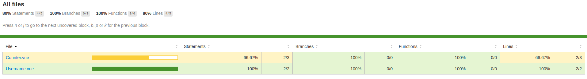
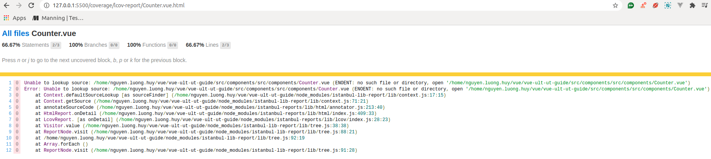
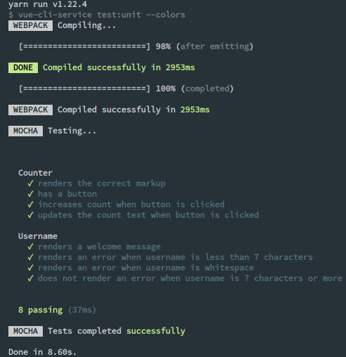
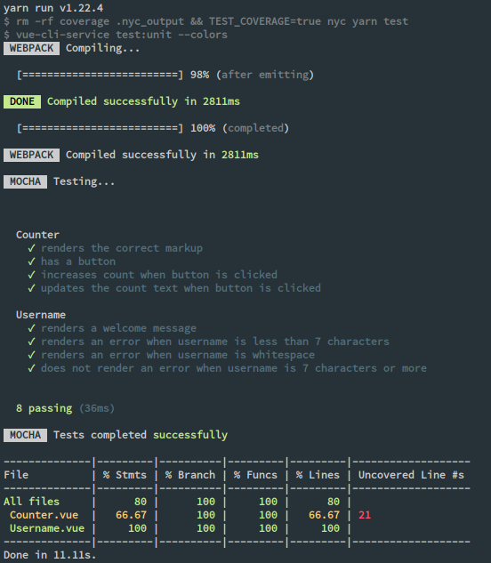
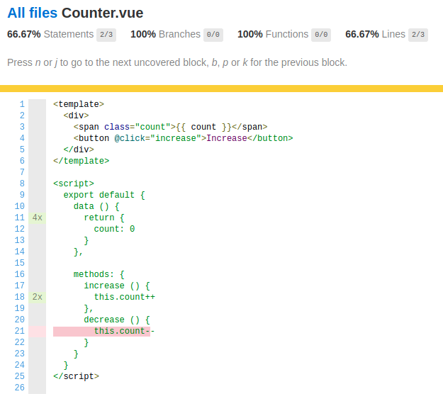
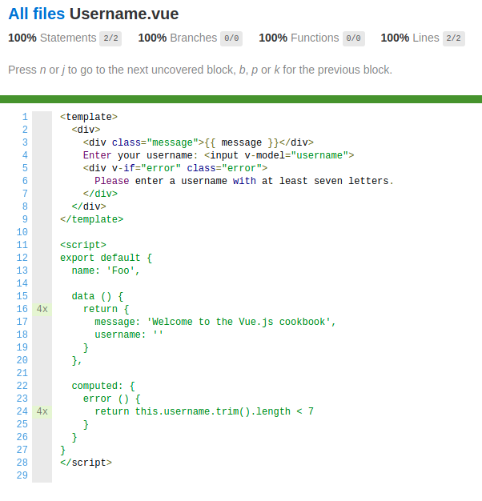

# Vue Ultimate UT Guide

## Test coverage with [istanbul/nyc](https://github.com/istanbuljs/nyc)



This guide is mainly focusing on how to setup code coverage report using `@vue/cli` with [`unit-mocha`](https://cli.vuejs.org/core-plugins/unit-mocha.html) plugin.

**Note**: If you are using [`webpack`](https://github.com/webpack/webpack) instead of `@vue/cli`, and [`mocha`](https://github.com/mochajs/mocha) as your test runner, there is a detailed, thorough guide written by [`vue-test-utils`](https://vue-test-utils.vuejs.org/guides/#testing-single-file-components-with-mocha-webpack) community, with the [`mochapack`](https://github.com/sysgears/mochapack/blob/master/docs/guides/code-coverage.md) code coverage guide.

### Requirements

- [x] [`yarn`](https://classic.yarnpkg.com/en/docs/install/#debian-stable) or [`npm`](https://www.npmjs.com/get-npm) (I'll using `yarn` throughout guide).
- [x] [`@vue/cli`](https://cli.vuejs.org/guide/prototyping.html) is installed.
- [x] [`@vue/cli-plugin-unit-mocha`](https://cli.vuejs.org/core-plugins/unit-mocha.html) and `chai` is added.
- [x] [`@vue/test-utils`](https://github.com/vuejs/vue-test-utils#readme) plugin is added.

### Setup

For a generic setup that works with Babel, TypeScript and others, you just need the following dependencies

- `nyc`: CLI for istanbul that collects coverage data & generates coverage reports.

- `istanbul-instrumenter-loader`: Loader that wraps your code with hooks to track coverage when your code get's executed.

Installing both of them using

```bash
yarn add --dev nyc istanbul-instrumenter-loader
```

Check `package.json` to make sure that both of them are installed correctly.

[**package.json**](https://github.com/huynl-96/vue-ult-ut-guide/blob/feature-setup-coverage/package.json)

```json
{
  ...
  "devDependencies": {
    ...
    "istanbul-instrumenter-loader": "^3.0.1",
    "nyc": "^15.1.0",
    ...
  }
  ...
}
```

Next step is to define some new scripts to run our tests with code coverage.

[**package.json**](https://github.com/huynl-96/vue-ult-ut-guide/blob/feature-setup-coverage/package.json)

```json
{
  ...
  "scripts": {
    ...
    "test": "vue-cli-service test:unit --colors",
    "cover": "rm -rf coverage .nyc_output && NODE_ENV=test nyc yarn test",
    ...
  }
  ...
}
```

### Configuration files

[**vue.config.js**](https://github.com/huynl-96/vue-ult-ut-guide/blob/feature-setup-coverage/vue.config.js)

```js
module.exports = {
  chainWebpack: config => {
    if (process.env.NODE_ENV === 'test') {
      config.devtool('eval') // ** IMPORTANT: Fix duplicate file-path twice **
      config.module
        .rule('js')
        .use('istanbul-instrumenter-loader')
        .loader('istanbul-instrumenter-loader')
        .options({ esModules: true })
        .after('babel-loader')
    }
  }
}
```

**Note**: The built-in webpack of `@vue/cli` uses `inline-cheap-module-source-map` as default devtool, which makes nyc works incorrectly so you probably ran into an issue where the file path is listed twice `<rootDir>/src/components/src/components/Component.vue`.



To fix this, just change the devtool into `config.devtool('eval')`. Read more about this issue [here](https://github.com/istanbuljs/nyc/issues/718).

[**nyc.config.js**](https://github.com/huynl-96/vue-ult-ut-guide/blob/feature-setup-coverage/nyc.config.js)

```js
module.exports = {
  'instrument': false,
  'sourceMap': false,
  'include': [
    'src/**/*.{js,vue}'
  ],
  'extension': [
    '.js',
    '.vue'
  ],
  'reporter': [
    'text',
    'lcov'
  ]
}
```

Let's go through each configuration options

- `instrument`: setting to `false` to stop nyc from instrumenting your code, that's the task of loader.

- `sourceMap`: setting to `false` to disable for the same reason like `instrument`.

- `include`: contains pattern for the location of your source files. Only the files that are listed in this list, are covered.

- `extension`: contains a list of extensions that nyc should attempt to handle.

- `reporter`: defines code coverage report formats.
  - By default nyc uses Istanbul's `text` reporter.
  - Specify other alternative reporters by listing them in an array. Example: `'reporter': ['text', 'lcov']`.
  - *Note*: All available reporters are listed [here](https://istanbul.js.org/docs/advanced/alternative-reporters/).

For more configuration options, visit [here](https://github.com/istanbuljs/nyc#common-configuration-options).

### Run tests

Running `yarn test` as below will let us know how many test cases are there, how many failed cases and passed cases.



Now, let's see what will happen when we run `yarn cover`

- `rm -rf coverage .nyc_output`: ubuntu command to remove files and directories.
`-rf` is the combining of `--recursive` (remove directories and their contents recursively) and `--force` (ignore nonexistent files and arguments, never prompt).

  ⇒ remove all directories, sub-directories, and files inside `coverage` and `.nyc_output` folders before running the test. This is to make sure that every time we run `yarn cover`, all contents in `coverage` and `.nyc_output` folders are re-new.

- `NODE_ENV=test`: create an environment variable `NODE_ENV` with the value of `test`. This variable will be used in `vue.config.js`.

- `nyc yarn test`: is compiled into `nyc vue-cli-service test:unit --colors` which runs the test with nyc doing the coverage for us.

  *Note*: More options for [vue-cli-service test:unit](https://cli.vuejs.org/core-plugins/unit-mocha.html#injected-commands)


> Code coverage results delivered by nyc text reporter.


> Code coverage results delivered by nyc lcov reporter.


> Which line of code is not coverage.


> 100% file coverage.

This guide is inspired by these following issues

- [vue-cli#1363](https://github.com/vuejs/vue-cli/issues/1363)
- [vue-test-utils#165](https://github.com/vuejs/vue-test-utils/issues/165)
